# Universidad Centroamericana José Simeón Cañas

# Ciclo 01/2023, Laboratorio: Configuración de un router y switch.
### Catedrática: Elisa Aldana 
### 2023, Antiguo Cuscatlan 

# Información teórica

El **router** o **enrutador** es un dispositivo que opera en capa tres de nivel de 3. Así, permite que varias
redes u ordenadores se conecten entre sí y, por ejemplo, compartan una misma conexión de Internet.
Un router se vale de un protocolo de enrutamiento, que le permite comunicarse con otros enrutadores
o encaminadores y compartir información entre sí para saber cuál es la ruta más rápida y adecuada
para enviar datos.
Un típico enrutador funciona en un plano de control (en este plano el aparato obtiene información
acerca de la salida más efectiva para un paquete específico de datos) y en un plano de reenvío (en este
plano el dispositivo se encarga de enviar el paquete de datos recibidos a otra interfaz).
El router tiene múltiples usos más o menos complejos. En su uso más común, un enrutador permite
que en una casa u oficina pequeña varias computadoras aprovechen la misma conexión a Internet. En
este sentido, el router opera como receptor de la conexión de red para encargarse de distribuirlo a
todos los equipos conectados al mismo. Así, se conecta una red o Internet con otra de área local.
Hoy por hoy, es sencillo obtener un router en forma más o menos económica de distintas marcas.
También existen aquellos routers que utilizan software de código libre y que por ende permiten un
ahorro económico mayor. Además, se han desarrollado softwares que facilitan la operación entre
redes aun si no se cuenta con un equipo de uso dedicado.
Por último, últimamente se han diseñado enrutadores inalámbricos, que operan con redes fijas y
móviles y, por lo tanto, pueden proveer de una conexión de Wi-Fi a los distintos dispositivos dentro
de una vivienda, oficina o incluso en un espacio mayor.

## Switches

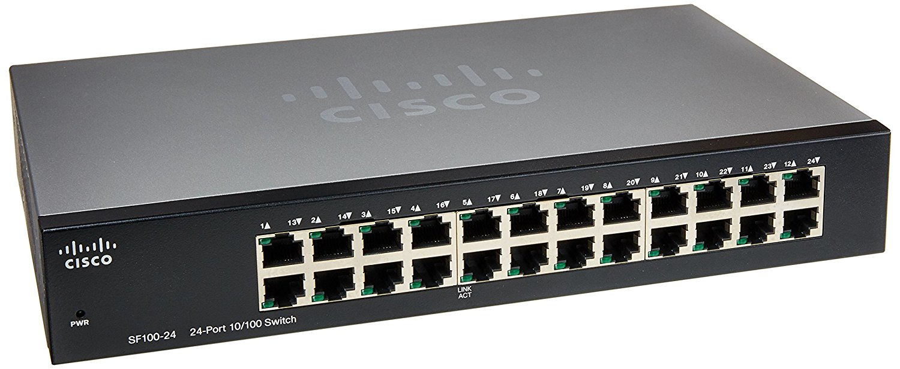

Los **switches** son piezas de construcción clave para cualquier red. **Conectan varios dispositivos**, como
computadoras, access points inalámbricos, impresoras y servidores; en la misma red dentro de un
edificio o campus. Un switch permite a los dispositivos conectados compartir información y
comunicarse entre sí.
Los switches se dividen en dos:

●**Switches no administrados**: Un switch de red no administrado está diseñado para que pueda
simplemente conectarlo y funcione, sin necesidad de configuración. Los switches no administrados se
usan generalmente para la conectividad básica. En general, se verán en redes domésticas o donde
sea que se necesiten unos cuantos puertos más, como en su escritorio, en un laboratorio o en una sala
de conferencias.

●**Switches administrados**: Los switches administrados le ofrecen mayor seguridad y más funciones y
flexibilidad, dado que puede configurarlos para que se adapten a su red. Con este mayor control, puede
proteger mejor su red y mejorar la calidad del servicio para los que acceden a la red.

## Algoritmos de enrutamiento

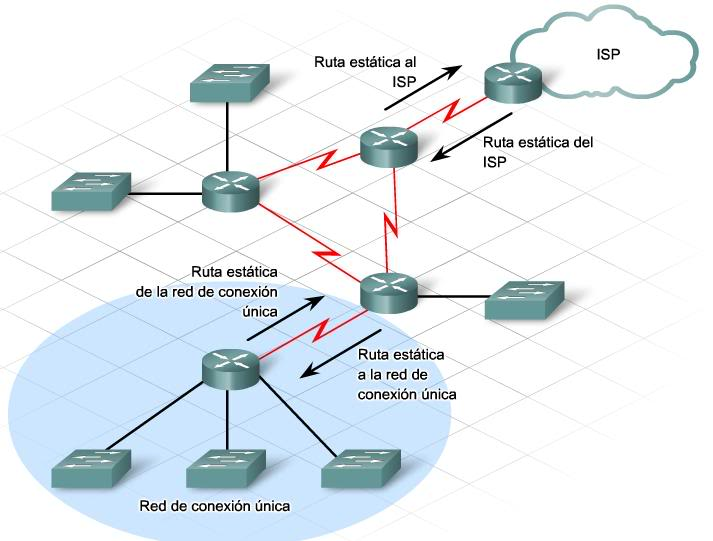

El **algoritmo de enrutamiento** es aquella parte del software de la capa de red responsable de **decidir por
cuál línea de salida se transmitirá un paquete entrante**.
Si la red usa datagramas de manera interna, esta decisión debe tomarse cada vez que llega un paquete
de datos, dado que la mejor ruta podría haber cambiado desde la última vez. Si la red usa circuitos
virtuales internamente, las decisiones de
enrutamiento se toman sólo al establecer un circuito virtual nuevo. En lo sucesivo,
los paquetes de datos simplemente siguen la ruta ya establecida. Este último caso a veces se llama
enrutamiento de sesión, dado que una ruta permanece vigente durante toda una sesión.
Sin importar si las rutas se eligen de manera independiente para cada paquete enviado o sólo cuando
se establecen nuevas conexiones, existen ciertas propiedades que todo algoritmo de enrutamiento debe
poseer: exactitud, sencillez, robustez, estabilidad, equidad y eficiencia.

●**Algoritmo de la ruta más corta:** La idea de este algoritmo es construir un grafo de la red, en donde
cada nodo del grafo representa un enrutador y cada arco del grafo representa una línea o enlace de
comunicaciones. Para elegir una ruta entre un par específico de enrutadores, el algoritmo simplemente
encuentra la ruta más corta entre ellos en el grafo, existen varios algoritmos para calcular la ruta más
corta.

●**Inundación:** Este algoritmo envía cada paquete por todas las vías de salida, excepto por la línea en la
que llegó, de este modo se asegura que el paquete llegue a su destino siempre y cuando exista alguna
vía, tiene grandes desventajas como la cantidad de paquetes duplicados generados pero es útil cuando
se busca transmitir un mensaje a todo aquel que lo pueda escuchar.

●**Enrutamiento por vector distancia:** opera haciendo que cada enrutador mantenga una tabla (llamada
vector) que proporcione la mejor distancia conocida a cada destino y el enlace que se puede usar para
llegar ahí. Para actualizar estas tablas se intercambia información con los vecinos. Éste fue el
algoritmo original de enrutamiento de ARPANET y también se usó en Internet con el nombre de RIP.
En este algoritmo cada enrutador mantiene una tabla de enrutamiento indicada por cada enrutador de
la red.

●**Enrutamiento por estado del enlace:** Este es el origen de OSPF, uno de los algoritmos más utilizados
dentro de las redes extensas y de internet actualmente, la idea es que cada router reconozca a sus
vecinos y calcule el costo de enviar un paquete a cada uno de ellos para luego enviárselos y recibir el
mismo dato de ellos, eventualmente todos los enrutadores conocerán la red completa y podrán calcular
la ruta más corta a partir de la
información obtenida.

●**Enrutamiento jerárquico:** Cuando se utiliza el enrutamiento jerárquico, los enrutadores se dividen en
lo que llamaremos regiones. Cada enrutador conoce todos los detalles para enrutar paquetes a destinos
dentro de su propia región, pero no sabe nada de la estructura interna de las otras regiones.

●**Enrutamiento por difusión:** El envío simultáneo de un paquete a todos los destinos se llama difusión
(broadcasting) y simplemente envía un paquete distinto a cada destino.El método es lento y requiere
de antemano la dirección de destino, pero tiene aplicaciones. Una mejora del algoritmo anterior es el
enrutamiento multidestino, en donde cada paquete contiene una lista de destinos deseados y después
de unos saltos el paquete contendrá un solo destino como un paquete normal .

●**Enrutamiento multidifusión:** El proceso de enviar un mensaje a uno de tales grupos se denomina
multidifusión (multicasting); el algoritmo de enrutamiento que se utiliza es el enrutamiento por
multidifusión. Los esquemas de enrutamiento por multidifusión se basan en los esquemas de
enrutamiento por difusión con la diferencia que ahora se establecen grupos bien definidos a los que les
concierne o que son los únicos que deberían recibir la información.

●**Enrutamiento Anycast:** En anycast, un paquete se entrega al miembro más cercano de un grupo, es
útil cuando necesitamos un dato y lo único que
importa es que la información sea correcta y no quien la envió.

●**Enrutamiento para host móviles:** Con la aparición de los dispositivos móviles surgió una nueva
complicación, para enviar un paquete a un host móvil primero hay que encontrar, la solución fue que
el host móvil indique su posición en todo momento a otro host llamado home agent para que este le
reciba los paquetes y puede enviarselos al host.

●**Enrutamiento en redes ad hoc:** Por lo general los routers se mantienen fijos, pero hay casos extremos
donde los routers se están moviendo, como trabajadores de emergencia en terremotos, vehículos
militares en un campo de batalla o una flota de barcos en el mar, a las redes de nodos que se forman
porque simplemente están cerca se les llama redes ad hoc (que está hecho para o en una situación
específica), puesto que no son tan frecuentes no se sabe claramente cual es el protocolo más útil, una
propuesta popular es una versión de vector distancia adaptado para funcionar en un entorno móvil
llamado AODV

# Creación de una VLAN haciendo uso de un switch y un router
## Creación de una vlan incorporando como primera instancia el switch.
****Materiales**:**
• Cable Serial-RJ-45 macho
• Cables UTP Armados
• Computadora con Putty instalado.
• Computadora cliente.
• Switch
• Router

**Procedimiento:**
1. Para comenzar esta práctica debes verificar que el cable de tipo “serial” este conectado al
PC y al dispositivo (Switch). (De no ser así pide ayuda a tu instructor)
2. En el escritorio encontraras un programa llamado PUTTY, a continuación, deberás abrirlo.

3. En la pantalla principal deberás seleccionar el radio botón “Serial”. Luego en el menú de la
izquierda seleccionar la opción “Serial”, para esta practica deberems revisar que numero de puerto posee nuestra computadora (***COM***), buscamos en la barra de tareas el administrador de dispositivos 

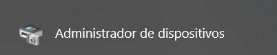

al acceder al admin de dispositivos, buscamos donde diga puertos com, desplegamos y nos dira el numero de puerto **COM**

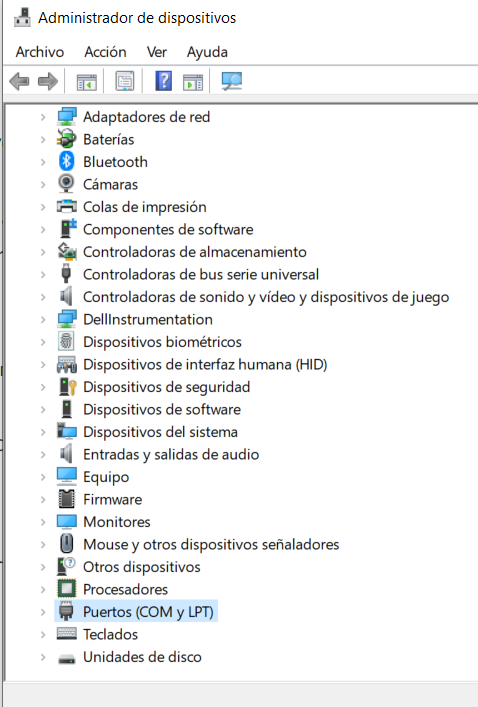

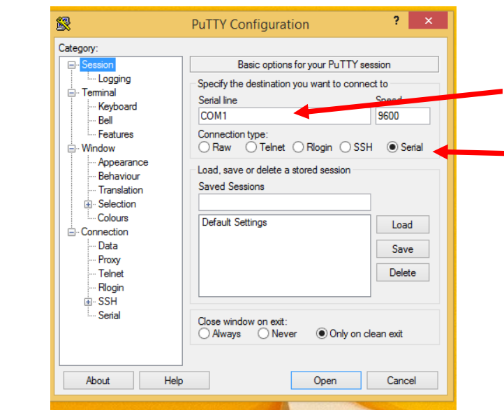

4. A continuación, deberás cambiar la opción “**Flow Control**” a “**None**” y dar click en “**Open**”.
Notaras que se ejecutara la consola de PUTTY.

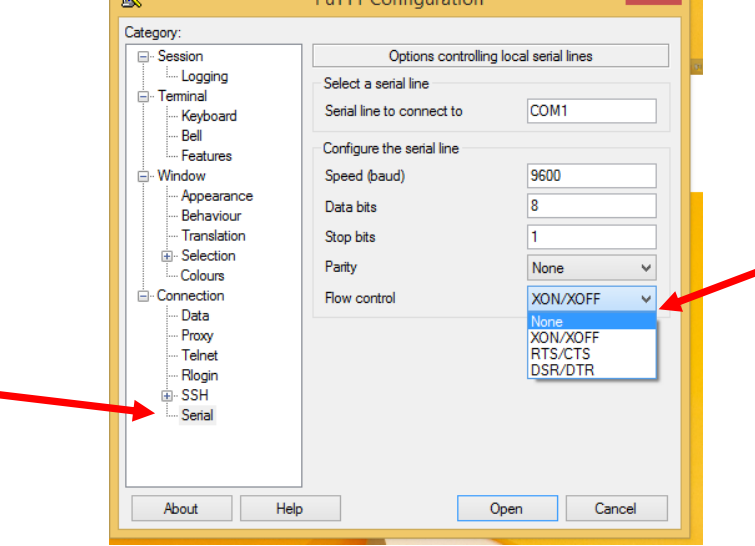

5. Si es primera vez que se inicia el dispositivo, empezaras con la configuración básica del Switch, tendrás que asignarle contraseña, nombre y alguna otra información. (A continuación, se muestran los comandos del primer inicio del dispositivo y como se debe configurar).

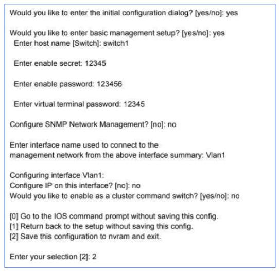

 
6.  Para poder asignar puertos a una red, debemos primero crearla, a continuación, se muestran un listado de comandos que deberás ejecutar para crear la VLAN.
 
 

     **- Switch>enable**
     **- Switch# configure terminal**   
     **- Switch(config)# Vlan 10**    
     **- Switch(config-vlan)# name [ejemplo]**       
     **- Switch(config-vlan)# exit**
     **-# exit**

 

7. Ahora ejecutaremos el comando show vlan para revisar la información previamenteconfigurada.
8. A continuación, introduciremos a la VLAN los puertos que necesitamos que se conecten e intercambien información entre sí, puedes eleegir los que desees, pero **recomendamos utilizar los puertos del 6 en adelante**.

    **#configure terminal**
    **#interface FastEthernet 0/10**
    **#switchport access vlan 10**
    
    **#exit**
    
    **#interface FastEthernet 0/12**
    **#switchport access vlan 10**
    
    **#exit**
    
    **#interface GigabitEthernet 0/1**
    **#switchport access vlan 10**
    
    **#end**
    **wr**

9. A continuación, verificaremos que los puertos se hayan asignado correctamente, para ello ejecutaremos el comando **show vlan**.
 
**Ahora que ya puedes crear una Vlan, deberas crear 2 Vlans más, con 2 puertos y el nombre que quieras! (no es necesario configurar el puerto GigabitEthernet, utiliza solo los FastEthernet)**

## Configuración de la velocidad de los puertos

Para velocidad se usa el comando "**speed**" seguido de un espacio y la velocidad en Mb (10, 100), para
fullduplex el comando "**duplex full**", es conveniente para evitar problemas dejar los ajustes en
automático con los comandos "**duplex auto**" y "**speed auto**" (que es como esta por defecto) y solo
ponerlo en manual si el equipo a conectar al puerto requiere una determinada velocidad y modo
duplex.

    #configure terminal
    #interface FastEthernet 0/1
    #speed 100
    #duplex full
    #end

10. Conectaremos los cables de red en los puertos configurados (en el switch) en un extremo, y
en el otro a las computadoras que te asignara tu instructor.
11. Conectaremos el switch con el router de gigabitethernet a gigabitethernet.

## Incorporación del router en la vlan.

13. A continuación, desconectaras el cable serial del Switch y lo conectaras en el router.
14. Notaras que la consola empieza a cambiar y a inicializar las configuraciones básicas del equipo.
15. Si el equipo no se encuentra configurado te pedirá ingresar la información básica.

    **Enter host name [Router]: <R1>
    Enter enable secret: 1234
    Enter enable password 12345
    Enter virtual terminal password: 1234**

16. Una vez finalizada la configuración anterior te pedirá ingresar el nombre de la interfaz a
configurar, a continuación, presionaras crtl + c.
17. Por último, debemos configurar los saltos de red dentro del router, asignar una dirección IP
con la respectiva puerta de enlace. Para ello ejecutaremos los siguientes comandos:

    **#enable
    #configure terminal
    #interface GigabitEthernet 0/1
    #ip address 192.168.0.2 255.255.255.0
    #no shutdown
    #ip default-gateway 192.168.0.1
    #end
    #wr**

18. Ahora verificaremos que el puerto este encendido para eso ejecutaremos el comando **sh ip int br**. Notaras que aparece la dirección ip asignada al puerto gigabit,
19. Como último paso deberás configurar las direcciones IP de las computadoras:

• Escribe en el buscador de Windows: **Panel de control**

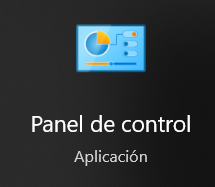

• Click en: **Redes e internet**

• Click en: **Centro de redes y recursos compartidos**
• Click en: **Ethernet**
• Click en: **propiedades**
• Click en: **Internet Protocol Ver.4 (IPv4)**

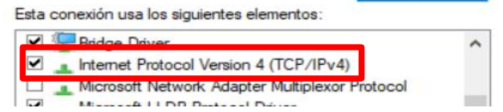

• A continuación, le asignamos las ip correspondiente a cada maquina, dando click
en usar la siguiente dirección IP, la asignamos y para el apartado de servidor
DNS asignamos el siguiente servidor DNS

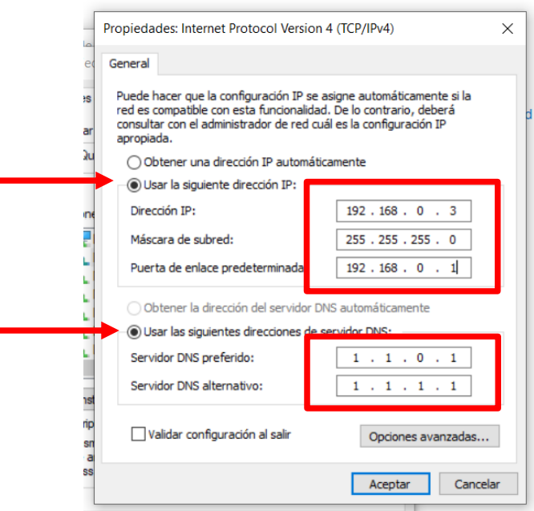

## Sugerencia de direcciones IP
       **PC1
    IP:192.168.0.3
    Mascara de subred:
    255.255.255.0 (Clase C)
    Puerta de enlace:
    192.168.0.1

       **PC2
    **IP:192.168.0.4
    Mascara de subred:
    255.255.255.0 (Clase C)
    Puerta de enlace:
    192.168.0.1
antes de hacer ping entre maquinas, deberemos de desactivar el firewall de windows, de la siguiente manera:

**-   Presiona la tecla de Windows + R para abrir la ventana Ejecutar.**
    
**-   Escribe "control" y presiona Enter para abrir el Panel de Control.**
    
**-   En el Panel de Control, busca "Sistema y Seguridad" y haz clic en él.**
    
**-   A continuación, haz clic en "Firewall de Windows".**
    
**-   En el menú de la izquierda, haz clic en "Activar o desactivar el Firewall de Windows".**
    
**-   Selecciona la opción "Desactivar Firewall de Windows (no recomendado)" tanto para la configuración de la red privada como para la configuración de la red pública.**
    
 -   **Haz clic en "Aceptar" para guardar los cambios.**

 
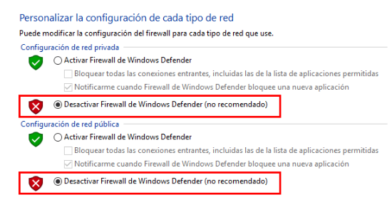

 Para verificar el correcto funcionamiento deberás hacer:
 

 - ping de Pc1 a Pc2
 - ping de Pc2 a Pc1
 - ping de Pc1 a Router (usando la terminal)
 - ping de Router a Pc1
 - ping de Pc2 a Router (usando la terminal)
 - ping de Router a Pc2
 
Si el ping se realiza correctamente, se mostrará información detallada sobre los paquetes enviados y recibidos, así como estadísticas sobre el número de paquetes perdidos y la velocidad de transmisión.

# Reinicio de switch y router

si deseas reiniciar el switch, es tan sencillo como **mantener apretado el boton de la parte de adelante, hasta que este comience a parpadear** (la consola de putty igualmente comenzara a cambiar, ese es un indicador de que se esta realizando con exito el reinicio y borrado de todos los datos del switch).
Y el switch queda reiniciado de fabrica en su totalidad, se recomienda apagar y encender el switch para asegurarse que se realizo con éxito esta operación

Si se desea reiniciar de fabrica un router, se utilizan los siguientes pasos:

    **router> enable
    router# write erase
    Erasing the nvram filesystem will remove all configuration files! Continue?
    [confirm] *Press Enter key*
    router# reload
    Proceed with reload? [confirm] <Press Enter key>**

Y el router queda reiniciado de fabrica en su totalidad, se recomienda apagar y encender el router para asegurarse que se realizo con éxito esta operación
Para reiniciar un switch, lo único que se debe de hacer es encenderlo, esperar a que este cargue (luz verde sin parpadear) y se presionara el botón (mode) hasta que las luces comiencen a parpadear, y se apague, se suelta el botón y el switch iniciara sin ninguna configuración, es decir, de fabrica)

